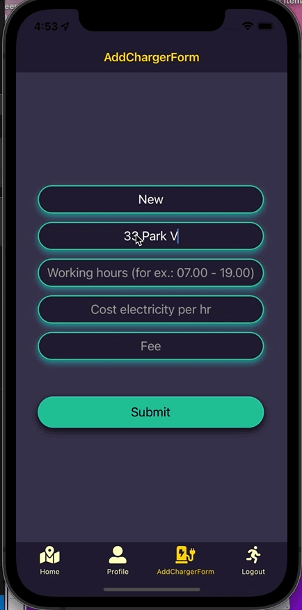

# ChargerHood
This is an app that can help people who want:
- to share your own EV charger,
- to find an EV charger.

AS a user you can:

- open the details of the charger, change the status for this charger, view reviews and leave a review

- add a new charger and see it in your profile page and map

This is version 0.1 of this app, to be continued :)

 
## Technologies Used
 - Front-end: React Native Expo CLI, GoogleMap API, CSS
 - Back-end: Ruby on Rails
 - Database: PostgreSQL

## Authors
_**Olha Gruzglina**_

## Contact Information

- [Olha's Github](https://github.com/ogruzglina "Olha Gruzglina")
- [Olha's Linkedin](https://www.linkedin.com/in/olha-gruzglina-a4403b53/ "Olha Gruzglina")